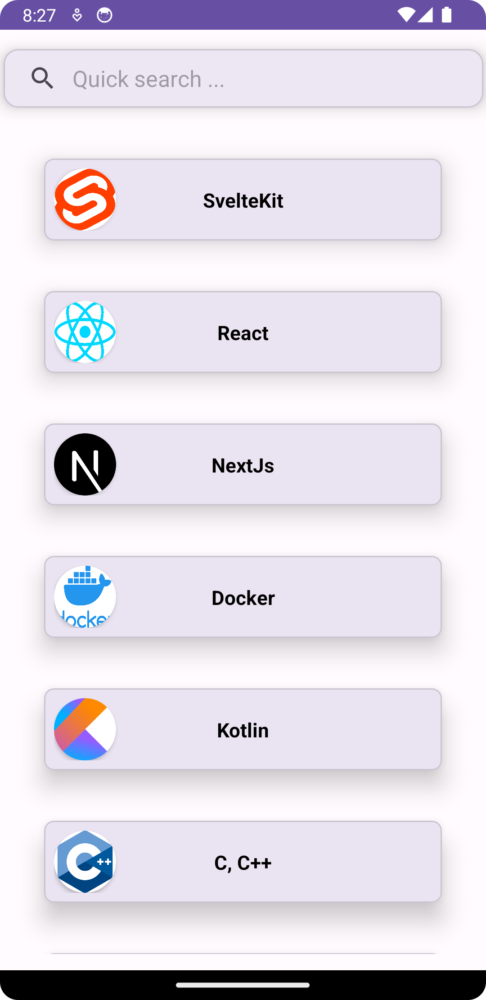
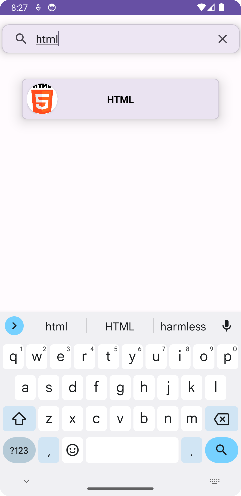

# Quicksearch
RecyclerView project to list my programming skills. 
School project done in 1 day. 
# Quicksearch app 

## Features

- **[Programming Skills Showcase](#programming-skills):** Discover and various programming skills that I learned
- **RecyclerView Integration:** Seamlessly scroll through the list of languages for a smooth user experience.
- **[SearchView Integration](#quicksearch-feature)** Quickly search from the list of available languages.

## Programming skills

## Quicksearch feature

## Getting Started

### Prerequisites

- Android Studio: Ensure you have the newest Android Studio (Girraffe) installed on your system.

### Installation

1. Clone the repository:

   ```bash
   git clone https://github.com/nigthguarder/Quicksearch.git
    ```
### Warning!
Before building the project set your compileSdk to atleast 34.

```
build.gradle.kts(:app):

android {
namespace = "com.example.quicksearch"
compileSdk = 34
```
2. **Open in Android Studio:**
- Build and compile the project
- The app will be installed on an Android emulator or connected device.
3. **Start your device:**
    - Open the app on your emulated device
4. **Click the cookie!**
